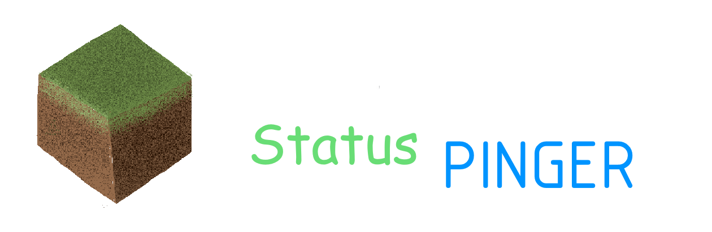
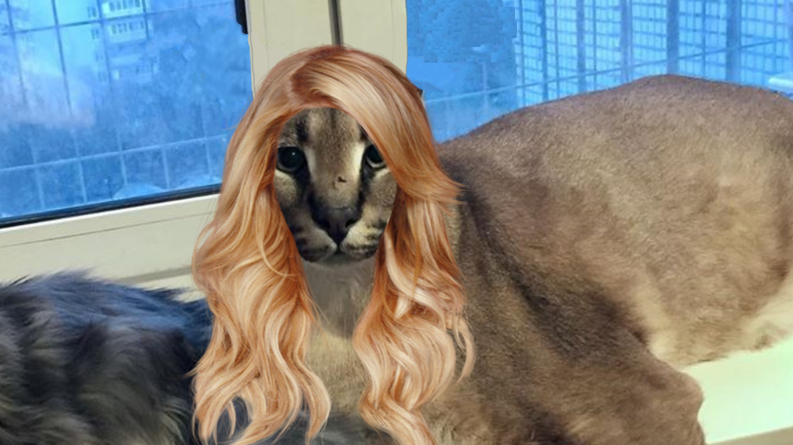

<h1 align="center">Hi 👋, I'm woodendoors7 </h1>
<h3 align="center">a guy that codes</h3>

- 🌱 I’m currently learning **Svelte, TS (don't look at the JS code of my sites)**

- 👨‍💻 This is a cool project website [https://floppa.hair](https://floppa.hair)

- 📫 How to reach me **houtendeur7#6052**

<h3 align="left">Connect with me:</h3>

  
  

<h3 align="left">Languages and Tools:</h3>

  <kbd>
    
    </kbd>

<kbd>
  
</kbd>

<h3 align="left">📚 Latest BlogPosts:</h3>
   • <a href="https://dev.to/woodendoors7/how-to-make-a-discord-bot-that-pings-your-minecraft-server-1ce2">How to make a Discord bot that pings your Minecraft server🤔</a> <kbd><b><a href="https://dev.to/woodendoors7/how-to-make-a-discord-bot-that-pings-your-minecraft-server-1ce2">DEV.TO</a></b></kbd><kbd><b><a href="https://medium.com/@woodendoors7/how-to-make-a-discord-bot-that-fetches-minecraft-servers-status-c48b3dfb214f">Medium</a></b></kbd>
